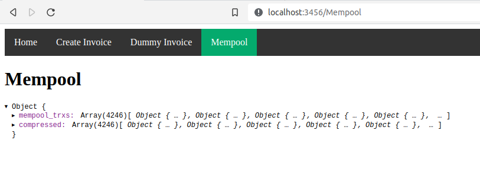
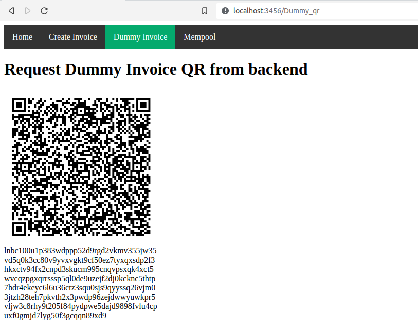
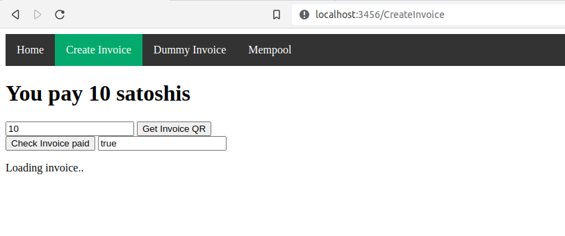

# Bitcoin python svelte playground
## Download the mempool as JSON


## Create a Dummy Invoice (with QR) in the backend


## Create a Real Invoice (with QR) in the backend


## Where to start
You should have a bitcoin lighning node (LND) up and running.
This repo assumes that you set it up similiar to the 
[raspibolt guide](https://raspibolt.org/)
## Install on your Bitcoin lightning node
### Clone Repo (e.g in admin user home dir)
```
git clone https://github.com/zynos/bitcoin-python-svelte-playground.git
cd bitcoin-python-svelte-playground/
```
### Backend
```
chmod +x create_backend.sh
./create_backend.sh
```

### Frontend
```
npm install
npm run dev -- --port 3456
```

## Deploy on your fullnode
### start frontend (inside "frontend" directory)
`npm run dev -- --port 3456`
### start backend (inside "backend" directory)
`uvicorn test:app --reload --port=8000`


## Tutorials:
- [Generate a lightning invoice with python](tutorials/01_generate_qr_code_lightning_invoice_python_svelte.md)
