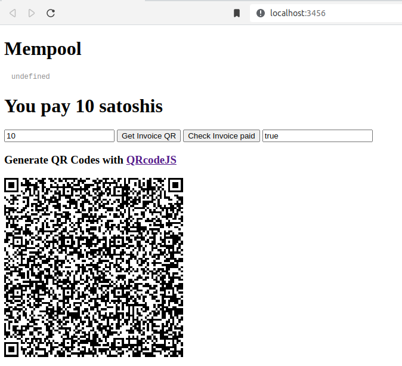

# Bitcoin python svelte playground

## Install
### Backend
```
cd backend
python3 -m venv venv
source venv/bin/activate
pip install -r requirements.txt
```
And follow these instructions:
https://github.com/lightningnetwork/lnd/blob/master/docs/grpc/python.md
### Frontend
```
npm install
npm run dev -- --port 3456
```

## Deploy on your fullnode
### start frontend (inside "frontend" directory)
`npm run dev -- --port 3456`
### start backend (inside "backend" directory)
`uvicorn test:app --reload --port=8000`

